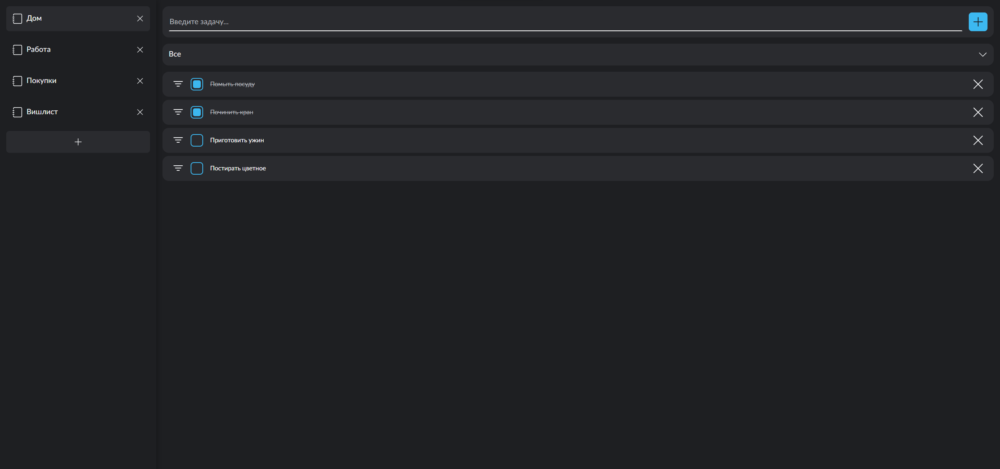

# 📝 Todo List App — React + TypeScript

## 📖 Описание проекта

Интерактивное приложение для управления списками задач с системой фильтров, локальным сохранением данных и встроенным onboarding-гайдом для первого запуска.

Разработано в рамках тестового задания с упором на чистоту архитектуры, отзывчивость интерфейса и современный стек.

### Скриншот приложения

## 

## 🚀 Технологии

- **React 19** — функциональные компоненты и хуки (`useState`, `useEffect`, `useCallback`, `useMemo`)
- **TypeScript** — строгая типизация данных и компонентов
- **Vite** — мгновенная сборка и HMR
- **SCSS Modules** — изолированные стили с BEM-структурой
- **LocalStorage** — персистентность данных между сессиями

---

## ⚙️ Функциональность

- Создание и удаление списков задач
- Добавление, редактирование и удаление задач внутри списка
- Фильтрация задач по статусу: **Все / Активные / Выполненные**
- Отметка задач как завершённых (checkbox)
- Подсчёт количества активных задач
- Автоматическое сохранение данных в `localStorage`
- Полностью кастомный **Select-компонент** с анимацией
- Интерактивный **гайд по интерфейсу (Guide)**, объясняющий логику работы приложения при первом запуске
- Поддержка управления клавиатурой

---

## 🧠 Архитектура

- Логика вынесена в пользовательские хуки:
  - `useTasks` — управление задачами и списками
  - `useLocalStorage` — синхронизация состояния с localStorage
- UI-компоненты атомарные, с чётким разграничением ответственности
- Стили написаны по принципу **BEM + CSS Variables**

<details>
<summary>📁 src/ — развернуть структуру</summary>

```text
├── App.tsx
├── main.tsx
├── UI/
│   ├── Button/
│   │   ├── Button.module.scss
│   │   └── Button.tsx
│   ├── Input/
│   │   ├── Input.module.scss
│   │   └── Input.tsx
│   └── Select/
│       ├── Select.module.scss
│       └── Select.tsx
├── assets/
│   └── fonts/
│       ├── Lato-Bold.woff
│       ├── Lato-Bold.woff2
│       ├── Lato-Regular.woff
│       ├── Lato-Regular.woff2
│       ├── Lato-Italic.woff
│       └── Lato-Italic.woff2
├── components/
│   ├── Guide/
│   │   ├── Guide.module.scss
│   │   └── Guide.tsx
│   ├── Sidebar/
│   │   ├── Sidebar.module.scss
│   │   └── Sidebar.tsx
│   ├── TaskForm/
│   │   ├── TaskForm.module.scss
│   │   └── TaskForm.tsx
│   ├── TaskItem/
│   │   ├── TaskItem.module.scss
│   │   └── TaskItem.tsx
│   └── TaskList/
│       ├── TaskList.module.scss
│       └── TaskList.tsx
├── hooks/
│   ├── useFilter.ts
│   ├── useLocalStorage.ts
│   └── useTasks.ts
├── styles/
│   ├── App.scss
│   ├── fonts.scss
│   ├── index.scss
│   └── mixins.scss
└── types/
    ├── filter.ts
    ├── list.ts
    └── task.ts

```

</details>

---

## 📦 Установка и запуск

```bash
# Установить зависимости
npm install

# Запустить проект в режиме разработки
npm run dev
```

---

## 💬 Комментарий по реализации

Мой первый проект на TypeScript, старался делать упор на чистую архитектуру и продакшен-уровень кода.
Особое внимание уделено UX: плавные анимации, визуальные переходы, интерактивный onboarding.

---

## 📋 Тестовое задание

### Цель

Проверить навыки работы с React + TypeScript: компоненты, состояние, работа со списками, фильтрация, хранение данных.

### Задание

Разработать приложение "Список задач" (Todo List).

### Требования

1. **Технологии:**

   - React
   - TypeScript
   - Vite (для сборки)

2. **Функциональность:**

   - Добавление задачи (input + кнопка "Добавить")
   - Отображение списка задач
   - Возможность отметить задачу как выполненную (чекбокс)
   - Удаление задачи
   - Фильтры: Все / Активные / Выполненные (фильтрация на клиенте)
   - Сохранение задач в localStorage (чтобы список не пропадал при обновлении страницы)

3. **Дополнительно (необязательно, но будет плюсом):**

   - Возможность редактировать текст задачи
   - Подсчёт количества активных задач («Осталось X задач»)

4. **Структура компонентов (пример):**

   - App.tsx — корневой компонент
   - TodoForm.tsx — форма добавления задачи
   - TodoList.tsx — список задач
   - TodoItem.tsx — отдельная задача

5. **Прочее:**
   - Весь код должен быть на TypeScript
   - Чистая структура и читаемый код
   - Минимум комментариев (только где нужно)

### Ожидаемый результат

Приложение, где можно:

- Добавлять задачи
- Редактировать и удалять их
- Отмечать выполненными
- Фильтровать по статусу
- После обновления страницы задачи остаются
